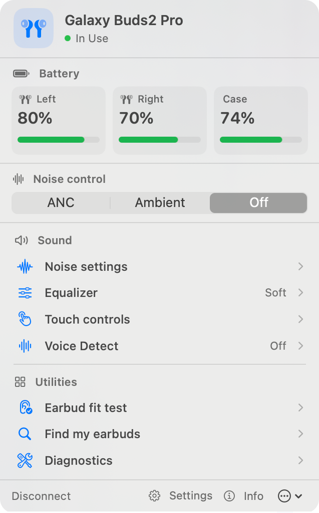
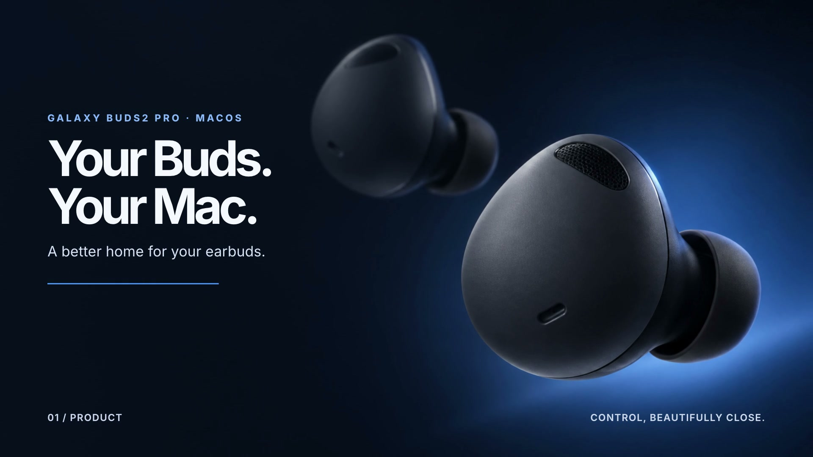
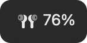

<p align="center">
  
</p>

<h1 align="center">Galaxy Buds Manager for macOS</h1>

<p align="center">
  Battery levels and everyday Buds2 Pro controls, one click from your menu bar.
</p>

<p align="center">
  <a href="https://github.com/heyaaakash/galaxy-buds-manager/releases/latest"><strong>Download for macOS</strong></a>
  · <a href="#compatibility">Compatibility</a>
  · <a href="Docs/CAPABILITY_MATRIX.md">Capability matrix</a>
  · <a href="#build-from-source">Build from source</a>
</p>

<p align="center">
  <a href="screenshots/menu-app-rounded.png"></a>
</p>

<p align="center"><sub>Connected Buds2 Pro menu bar view. Battery levels reflect the device at the time of capture.</sub></p>

An independent, unofficial native Swift app for macOS 14 or newer. It appears in macOS as **Galaxy Buds2 Pro Manager** and is not affiliated with Samsung.

## Watch the launch video

<p align="center">
  <a href="brag-output-2026-09-29-140648/brag.mp4"></a>
</p>

<p align="center"><sub>Click to watch the 23-second video. The earbud close-up is illustrative; the app interface is a real capture.</sub></p>

## What you can do

| At a glance | One-click controls | When you need more |
|---|---|---|
| See left, right, and case battery levels, charging, and placement. | Switch Buds2 Pro between ANC, Ambient, and Off. | Open EQ, touch controls, Voice Detect, fit test, ringing, and diagnostics. |

The detailed controls are for **Galaxy Buds2 Pro (SM-R510)**. Other recognized models have an experimental battery and placement view only; the app does not send them setting commands. The [capability matrix](Docs/CAPABILITY_MATRIX.md) separates implemented features from hardware validation.

The menu bar can also show the current battery level:

<p align="center"></p>

## Download

Get the latest DMG from [Releases](https://github.com/heyaaakash/galaxy-buds-manager/releases/latest). Choose `arm64` for an Apple Silicon Mac or `x86_64` for an Intel Mac, then drag the app to Applications.

The DMGs are ad-hoc signed and **not notarized**. If macOS blocks the first launch and you trust the download, try opening the app, then use **System Settings → Privacy & Security → Open Anyway**. See [Apple's instructions](https://support.apple.com/guide/mac-help/open-a-mac-app-from-an-unknown-developer-mh40616/mac). Each release includes `SHA256SUMS.txt` for checking the download.

## Compatibility

| Earbuds | Current support | Validation |
|---|---|---|
| Galaxy Buds2 Pro (SM-R510) | Battery, controls, and diagnostics | Tested with one physical device |
| Buds+, Buds Live, Buds Pro, Buds2, Buds FE, Buds3, Buds3 Pro | Experimental battery and placement display; no settings controls | No physical-device testing in this project |
| Original Galaxy Buds and other models | Detection only; app connection disabled | Protocol support not implemented |

Recognition does not guarantee a model will send battery data. See the [full capability and validation matrix](Docs/CAPABILITY_MATRIX.md) for feature limits and test evidence.

## Use the app

1. Pair and connect your earbuds in **System Settings → Bluetooth**.
2. Open their case or wear them, then launch the app and allow Bluetooth access.
3. Click the earbuds icon in the menu bar. The app attaches after macOS reports the earbuds connected.

The app does not connect disconnected earbuds for you. If **Attach** is unavailable, connect them in macOS first. Audio output remains under macOS control.

On Buds2 Pro, you can also adjust ambient settings, EQ, touch and long-press controls, Voice Detect, and more. Reboot, power-off, and factory reset require confirmation. Some controls depend on firmware; see the [capability matrix](Docs/CAPABILITY_MATRIX.md). Firmware updates, renaming, Samsung 360 Audio, and SmartThings location are not provided.

## Build from source

On a Mac with a working Swift toolchain and macOS SDK:

```sh
git clone https://github.com/heyaaakash/galaxy-buds-manager.git
cd galaxy-buds-manager
swift test
./run.sh          # Build and launch a local debug app
./build_app.sh    # Create an app and DMG in dist/
```

Run the app bundle rather than a bare `swift run` executable so macOS can associate Bluetooth permission with the app. See [CONTRIBUTING.md](CONTRIBUTING.md) before proposing a code change.

## Privacy and license

The app stores the last observed Buds name and Bluetooth address plus preferences on your Mac. It has no telemetry or network service. Exported protocol logs may contain device addresses or serial numbers; remove those before sharing.

The source is [GPL-3.0-only](LICENSE). Protocol facts were checked against the GPLv3-licensed [GalaxyBudsClient](https://github.com/timschneeb/GalaxyBudsClient); this Swift implementation was written for this app.

Copyright © 2026 Aakash Rohilla.
